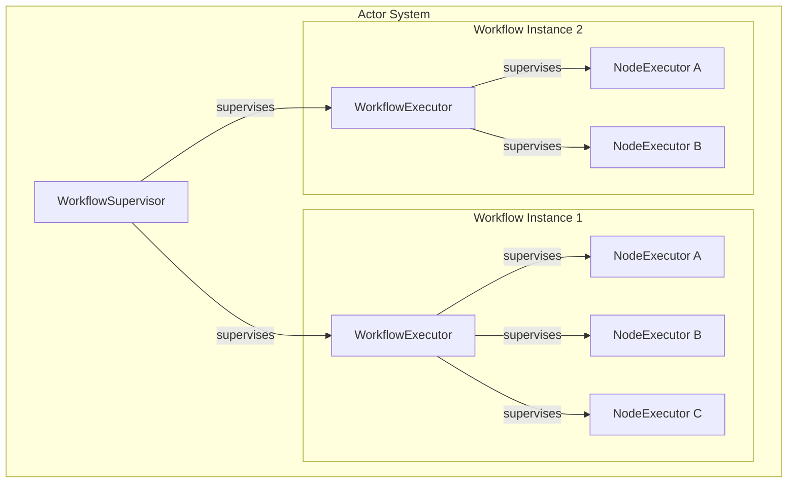
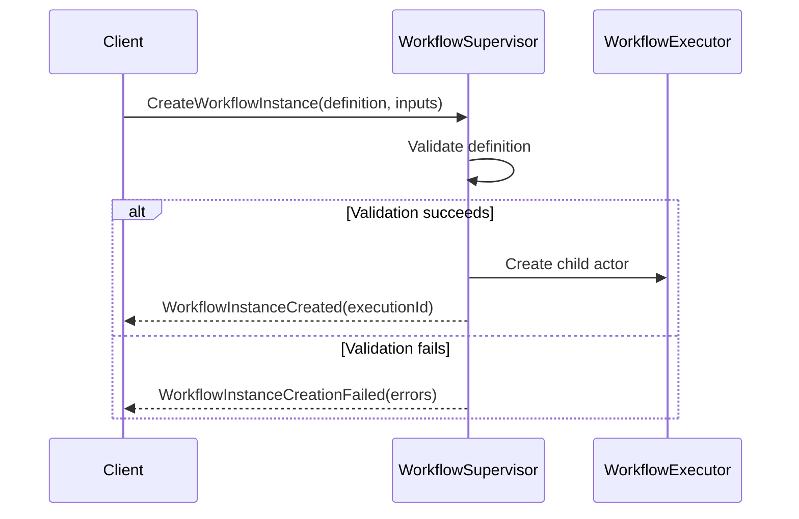
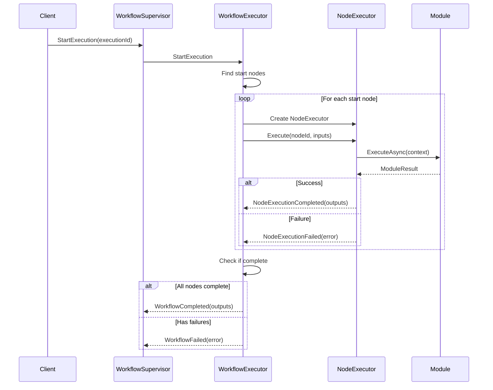
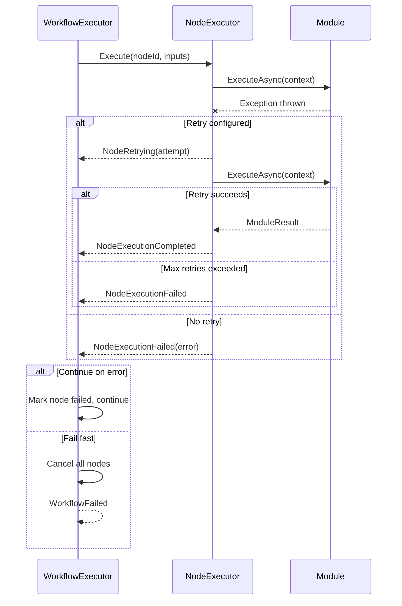
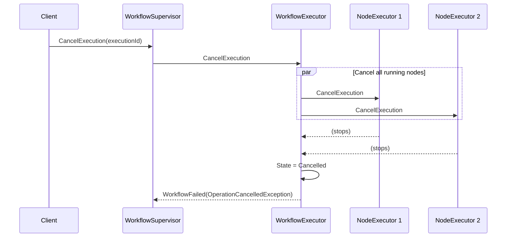

# Phase 1.3: Basic Akka.NET Engine (Week 2-4)

This sub-phase focuses on implementing the core actor-based workflow execution engine using Akka.NET. The engine consists of three main actors working together to orchestrate workflow execution. 🎭✨

---

## 1.3.1 WorkflowSupervisor Actor Implementation ✅ **COMPLETE!**

**Purpose:** Top-level actor responsible for managing workflow lifecycle and supervising workflow executor actors.

**Tasks:**
- [x] **Implement `WorkflowSupervisor` actor** 🎭
  - [x] Create actor class inheriting from `ReceiveActor`
  - [x] Add private field for tracking active workflows (Dictionary)
  - [x] Implement constructor with dependency injection
  - [x] Define message handlers
    - [x] Handle `CreateWorkflowInstance` message
      - [x] Validate workflow definition
      - [x] Generate unique execution ID
      - [x] Create child `WorkflowExecutor` actor
      - [x] Store actor reference in dictionary
      - [x] Reply with execution ID
    - [x] Handle `GetWorkflowStatus` message
      - [x] Look up executor actor
      - [x] Forward status request
      - [x] Return status to sender
    - [x] Handle `CancelWorkflow` message
      - [x] Look up executor actor
      - [x] Send cancellation message
      - [x] Clean up if needed
    - [x] Handle `Terminated` message (child death watch)
      - [x] Remove actor from tracking dictionary
      - [x] Log termination reason
      - [x] Notify subscribers
  - [x] Configure supervision strategy
    - [x] Define restart directive for recoverable errors
    - [x] Define stop directive for unrecoverable errors
    - [x] Set max retry limits (e.g., 3 retries in 1 minute)
  - [x] Add structured logging with context
  - [x] Add execution metrics (duration, memory, etc.)

**Tests:**
- [x] **WorkflowSupervisor-specific tests** 🎭
  - [x] Test supervisor creation and initialization
  - [x] Test workflow instance creation
  - [x] Test multiple concurrent workflow instances
  - [x] Test workflow status queries
  - [x] Test workflow cancellation
  - [x] Test child actor death watch (basic test - full testing in 1.3.2)
  - [ ] Test supervision directives (requires failure scenarios - deferred to integration tests)
  - [ ] Test max retry enforcement (requires failure scenarios - deferred to integration tests)

**Completion Date:** December 23, 2025 🎉  
**Test Coverage:** 8 comprehensive tests written!  
**Files Created:**
- ✅ `Workflow.Engine/Messages/WorkflowMessages.cs` - Complete message protocol
- ✅ `Workflow.Engine/Actors/WorkflowSupervisor.cs` - Full implementation
- ✅ `Workflow.Engine/Actors/WorkflowExecutor.cs` - Stub (will be completed in 1.3.2)
- ✅ `Workflow.Tests/Engine/Actors/WorkflowSupervisorTests.cs` - 8 tests

---

## 1.3.2 WorkflowExecutor Actor Implementation ✅ **COMPLETE!**

**Purpose:** Orchestrates execution of a single workflow instance, managing the execution graph and coordinating node actors.

**Tasks:**
- [x] **Implement `WorkflowExecutor` actor** 🎬
  - [x] Create actor class inheriting from `ReceiveActor`
  - [x] Add private fields for state management
    - [x] Workflow definition
    - [x] Execution context
    - [x] Node actor references (Dictionary)
    - [x] Execution graph/topology
    - [x] Completed nodes tracking (HashSet)
    - [x] Failed nodes tracking
  - [x] Define message handlers
    - [x] Handle `StartExecution` message
      - [x] Initialize execution context
      - [x] Parse workflow graph
      - [x] Identify start nodes (no dependencies)
      - [x] Create NodeExecutor actors for start nodes
      - [x] Send `Execute` messages to start nodes
      - [x] Update state to `Running`
    - [x] Handle `NodeExecutionCompleted` message
      - [x] Mark node as completed
      - [x] Store node outputs
      - [x] Determine next nodes to execute
      - [x] Check if outputs satisfy connection conditions
      - [x] Create NodeExecutor actors for next nodes
      - [x] Pass input data from previous node outputs
      - [x] Check if workflow is complete (all nodes done)
      - [x] If complete, send `WorkflowCompleted` to parent
    - [x] Handle `NodeExecutionFailed` message
      - [x] Mark node as failed
      - [x] Log error details
      - [x] Check error handling configuration
      - [ ] If retry configured, schedule retry (deferred to 1.3.7)
      - [x] If continue-on-error, proceed to next nodes
      - [x] If fail-fast, cancel all other nodes
      - [x] Send `WorkflowFailed` to parent
    - [x] Handle `CancelExecution` message
      - [x] Send cancel to all running node actors
      - [x] Update state to `Cancelled`
      - [x] Clean up resources
      - [x] Notify parent
    - [x] Handle `GetProgress` message
      - [x] Calculate completion percentage
      - [x] Gather status from all nodes
      - [x] Return progress details
  - [x] Implement execution graph traversal
    - [x] Topological sort for dependency order
    - [x] Handle parallel execution paths
    - [x] Detect and handle fan-out/fan-in patterns
  - [x] Add execution timing and metrics
  - [ ] Implement state persistence (for resumability) (deferred to Phase 2)

**Tests:**
- [x] **WorkflowExecutor-specific tests** 🎬
  - [x] Test executor creation and initialization
  - [x] Test workflow start execution
  - [x] Test node completion handling
  - [x] Test node failure handling (basic - see continue-on-error)
  - [x] Test execution graph traversal (linear workflow test)
  - [ ] Test parallel path execution (deferred - need parallel workflow test)
  - [x] Test workflow completion detection
  - [x] Test workflow cancellation
  - [x] Test progress tracking
  - [ ] Test state persistence (deferred to Phase 2)

**Completion Date:** December 23, 2025 🎉  
**Test Coverage:** 14 comprehensive tests written!  
**Files Created/Modified:**
- ✅ `Workflow.Engine/Actors/WorkflowExecutor.cs` - Full implementation (~500 lines)
- ✅ `Workflow.Engine/Actors/NodeExecutor.cs` - Functional stub (~150 lines)
- ✅ `Workflow.Tests/Engine/WorkflowExecutorTests.cs` - 14 tests

---

## 1.3.3 NodeExecutor Actor Implementation ✅ **COMPLETE!**

**Purpose:** Executes a single workflow node by invoking the appropriate module with the correct inputs.

**Tasks:**
- [x] **Implement `NodeExecutor` actor** ✨
  - [x] Create actor class inheriting from `ReceiveActor`
  - [x] Add private fields
    - [x] Module instance reference (via IModuleRegistry)
    - [x] Node configuration
    - [x] Execution context
    - [x] Cancellation token source
  - [x] Define message handlers
    - [x] Handle `Execute` message
      - [x] Log execution start
      - [x] Validate input data against schema
      - [x] Bind properties from configuration
      - [x] Create module execution context
      - [x] Call module's `ExecuteAsync` method
      - [x] Handle success case
        - [x] Validate outputs against schema (basic)
        - [x] Send `NodeExecutionCompleted` to parent
        - [x] Include output data
      - [x] Handle failure case (try-catch)
        - [x] Log exception details
        - [x] Send `NodeExecutionFailed` to parent
        - [x] Include error information
      - [x] Handle timeout case
        - [x] Cancel execution token
        - [x] Log timeout
        - [x] Send failure message
    - [x] Handle `Cancel` message
      - [x] Trigger cancellation token
      - [x] Interrupt module execution
      - [ ] Send cancellation acknowledgment (parent stops actor directly)
    - [ ] Handle `GetProgress` message (if module supports it) - Deferred
      - [ ] Query module progress
      - [ ] Return progress percentage
  - [x] Implement timeout management
    - [x] Use `Context.SetReceiveTimeout`
    - [x] Configure from node configuration
    - [x] Default to reasonable timeout (30 seconds)
  - [x] Add detailed execution logging
  - [x] Implement input/output data validation
  - [x] Add execution metrics (duration)
  - [x] Implement fallback stub execution for unregistered modules

**Tests:**
- [x] **NodeExecutor-specific tests** ✨
  - [x] Test node executor creation
  - [x] Test node execution success (with registered module)
  - [x] Test node execution failure (module throws)
  - [x] Test input passing to modules
  - [x] Test fallback stub for unregistered modules
  - [ ] Test timeout handling (deferred - requires slow module)
  - [x] Test cancellation
  - [x] Test duplicate execution prevention
  - [ ] Test metrics collection (deferred)

**Module Infrastructure Created:**
- ✅ `Workflow.Modules/Abstractions/IWorkflowModule.cs` - Module interface and types
- ✅ `Workflow.Modules/Abstractions/IModuleRegistry.cs` - Registry interface
- ✅ `Workflow.Modules/InMemoryModuleRegistry.cs` - In-memory implementation
- ✅ `Workflow.Modules/Builtin/PassThroughModule.cs` - Test module

**Completion Date:** December 27, 2025 🎉  
**Test Coverage:** 7 comprehensive tests written!  
**Files Created/Modified:**
- ✅ `Workflow.Engine/Actors/NodeExecutor.cs` - Full implementation (~400 lines)
- ✅ `Workflow.Modules/Abstractions/IWorkflowModule.cs` - Module contracts
- ✅ `Workflow.Modules/Abstractions/IModuleRegistry.cs` - Registry interface
- ✅ `Workflow.Modules/InMemoryModuleRegistry.cs` - Registry implementation
- ✅ `Workflow.Modules/Builtin/PassThroughModule.cs` - Built-in module
- ✅ `Workflow.Tests/Engine/NodeExecutorTests.cs` - 7 tests

---

## 1.3.4 Actor Messaging Protocol

**Purpose:** Define the message contracts that enable communication between actors in the system, with proper immutability, serialization, and validation.

### Design Decisions

#### Collections: LanguageExt
All collection properties in messages should use LanguageExt types for:
- **Immutability** - Messages should never be modified after creation
- **Structural Equality** - Two messages with same content should be equal
- **Thread Safety** - Safe to pass between actors without copying

| Use Case | Type |
|----------|------|
| Key-value data (inputs, outputs, properties) | `HashMap<string, object?>` |
| Ordered lists | `Arr<T>` |
| Sets (unique items) | `HashSet<T>` |
| Optional values | `Option<T>` |

#### Serialization: Dual Format Support
Messages need serialization for:
1. **Akka.NET Persistence** - Event sourcing, snapshotting
2. **External APIs** - REST endpoints, SignalR
3. **High-performance scenarios** - Cluster communication

**Packages to add:**
- `System.Text.Json` - Already included, add `[JsonPropertyName]` attributes
- `MessagePack.Annotations` - Lightweight annotations only (not full MessagePack)

```xml
<PackageReference Include="MessagePack.Annotations" />
```

#### Message Validation: Basic
Implement basic validation:
- Null checks on required fields
- Empty GUID detection
- Empty string detection for required strings
- Use `Validation<Error, T>` from LanguageExt for validation results

---

### Tasks

- [ ] **Update existing message records to use LanguageExt** 📬
  - [ ] Replace `Dictionary<string, object?>` with `HashMap<string, object?>`
  - [ ] Replace `Dictionary<string, NodeExecutionState>` with `HashMap<string, NodeExecutionState>`
  - [ ] Add `Option<T>` for nullable reference types where appropriate
  
- [ ] **Add serialization attributes** 📦
  - [ ] Add `[MessagePackObject(keyAsPropertyName: true)]` to message records such that property names are the keys
  - [ ] Add `[JsonPropertyName]` where property names need customization
  - [ ] Ensure all types are serializable (no lambdas, no delegates)
  
- [ ] **Add missing messages for complete protocol** ➕
  - [ ] `WorkflowInstanceCreationFailed` - Response when creation fails
  - [ ] `PauseExecution` - Request to pause a running workflow
  - [ ] `ResumeExecution` - Request to resume a paused workflow
  - [ ] `RetryNode` - Request to retry a failed node
  - [ ] `NodeRetrying` - Notification that a node is being retried
  - [ ] `ExecutionPaused` - Confirmation that execution is paused
  - [ ] `ExecutionResumed` - Confirmation that execution resumed

- [ ] **Add message validation** ✅
  - [ ] Create `MessageValidation` static class
  - [ ] Add `Validate()` extension method for each message type
  - [ ] Return `Validation<Error, TMessage>` from LanguageExt
  - [ ] Validate required fields are not null/empty
  - [ ] Validate GUIDs are not empty
  - [ ] Validate collections are not null (can be empty)

- [ ] **Document message flow** 📊
  - [ ] Create Mermaid diagrams for actor relationships
  - [ ] Create sequence diagrams for key workflows
  - [ ] Document message ordering guarantees
  - [ ] Document error scenarios

---

### Complete Message Protocol

#### Supervisor Messages (WorkflowSupervisor)

| Message | Direction | Description |
|---------|-----------|-------------|
| `CreateWorkflowInstance` | → Supervisor | Request to create new workflow |
| `WorkflowInstanceCreated` | ← Supervisor | Success response with execution ID |
| `WorkflowInstanceCreationFailed` | ← Supervisor | Failure response with errors |
| `GetWorkflowStatus` | → Supervisor | Query workflow status |
| `WorkflowStatusResponse` | ← Supervisor | Status information |
| `CancelExecution` | → Supervisor | Request cancellation |

#### Executor Messages (WorkflowExecutor)

| Message | Direction | Description |
|---------|-----------|-------------|
| `StartExecution` | → Executor | Begin workflow execution |
| `PauseExecution` | → Executor | Pause running workflow |
| `ResumeExecution` | → Executor | Resume paused workflow |
| `ExecutionPaused` | ← Executor | Confirmation of pause |
| `ExecutionResumed` | ← Executor | Confirmation of resume |
| `GetProgress` | → Executor | Query progress |
| `ProgressUpdate` | ← Executor | Progress information |
| `WorkflowCompleted` | ← Executor | Workflow finished successfully |
| `WorkflowFailed` | ← Executor | Workflow finished with error |

#### Node Messages (NodeExecutor)

| Message | Direction | Description |
|---------|-----------|-------------|
| `Execute` | → Node | Execute the node |
| `CancelExecution` | → Node | Cancel node execution |
| `RetryNode` | → Node | Retry failed node |
| `NodeExecutionCompleted` | ← Node | Node finished successfully |
| `NodeExecutionFailed` | ← Node | Node finished with error |
| `NodeRetrying` | ← Node | Node is being retried |

---

### Message Flow Diagrams

#### Actor Hierarchy (Mermaid)



#### Workflow Creation Sequence



#### Workflow Execution Sequence



#### Error Handling Sequence



#### Cancellation Sequence



---

### Message Record Definitions (Updated)

```csharp
// Example of updated message with LanguageExt and serialization attributes
[MessagePackObject]
public record CreateWorkflowInstance(
    [property: Key(0)] Guid WorkflowId,
    [property: Key(1)] WorkflowDefinition Definition,
    [property: Key(2)] HashMap<string, object?> Inputs) : IWorkflowMessage;

[MessagePackObject]
public record WorkflowInstanceCreationFailed(
    [property: Key(0)] Guid WorkflowId,
    [property: Key(1)] Arr<string> Errors) : IWorkflowMessage;

[MessagePackObject]
public record NodeExecutionCompleted(
    [property: Key(0)] string NodeId,
    [property: Key(1)] HashMap<string, object?> Outputs,
    [property: Key(2)] Guid ExecutionId,
    [property: Key(3)] TimeSpan Duration) : IWorkflowMessage;
```

---

### Validation Examples

```csharp
public static class MessageValidation
{
    public static Validation<Error, CreateWorkflowInstance> Validate(
        this CreateWorkflowInstance message)
    {
        var errors = new List<Error>();
        
        if (message.WorkflowId == Guid.Empty)
            errors.Add(Error.New("WorkflowId cannot be empty"));
        if (message.Definition == null)
            errors.Add(Error.New("Definition is required"));
        if (message.Inputs == null)
            errors.Add(Error.New("Inputs cannot be null (use empty HashMap)"));
            
        return errors.Count == 0 
            ? Success<Error, CreateWorkflowInstance>(message)
            : Fail<Error, CreateWorkflowInstance>(errors.ToSeq());
    }
}
```

---

### Tests

- [ ] **Message structure tests** 📨
  - [ ] Test all messages implement IWorkflowMessage
  - [ ] Test message immutability (records)
  - [ ] Test structural equality with LanguageExt collections
  - [ ] Test HashMap serialization round-trip
  - [ ] Test Arr serialization round-trip

- [ ] **Message validation tests** ✅
  - [ ] Test validation catches empty GUIDs
  - [ ] Test validation catches null required fields
  - [ ] Test validation passes for valid messages
  - [ ] Test validation accumulates multiple errors

- [ ] **Message serialization tests** 📦
  - [ ] Test System.Text.Json serialization
  - [ ] Test MessagePack serialization
  - [ ] Test serialization preserves all properties
  - [ ] Test serialization handles Option<T> correctly
  - [ ] Test serialization handles HashMap correctly

- [ ] **Message flow integration tests** 🔄
  - [ ] Test Tell (fire-and-forget) messaging
  - [ ] Test Ask (request-response) messaging
  - [ ] Test message ordering between actors
  - [ ] Test dead letter handling

---

### Dependencies to Add

```xml
<!-- In Directory.Packages.props -->
<PackageVersion Include="MessagePack.Annotations" Version="2.5.140" />
```

```xml
<!-- In Workflow.Engine.csproj -->
<PackageReference Include="MessagePack.Annotations" />
```

---

### Files to Create/Modify

| File | Action | Description |
|------|--------|-------------|
| `Workflow.Engine/Messages/WorkflowMessages.cs` | Modify | Update to use LanguageExt, add serialization |
| `Workflow.Engine/Messages/MessageValidation.cs` | Create | Validation extension methods |
| `Workflow.Tests/Engine/MessageTests.cs` | Create | Message structure and validation tests |
| `Workflow.Tests/Engine/MessageSerializationTests.cs` | Create | Serialization round-trip tests |
| `docs/MESSAGE_FLOW.md` | Create | Message flow documentation with diagrams |

**Key Actors Reference:**
```
✅ WorkflowSupervisor - Manages workflow lifecycle, creates/tracks executors
✅ WorkflowExecutor   - Executes a single workflow instance, manages node graph
✅ NodeExecutor       - Executes a single node via module invocation
⏳ ExecutionMonitor   - Tracks execution progress (optional, Phase 2)
```

**Complete Message Protocol Reference:**
```
Supervisor Messages:
  ✅ CreateWorkflowInstance(workflowId, definition, inputs) → Supervisor
  ✅ WorkflowInstanceCreated(executionId, workflowId)       ← Supervisor
  ⏳ WorkflowInstanceCreationFailed(workflowId, errors)     ← Supervisor [NEW]
  ✅ GetWorkflowStatus(executionId)                         → Supervisor
  ✅ WorkflowStatusResponse(...)                            ← Supervisor
  ✅ CancelExecution(executionId)                           → Supervisor

Executor Messages:
  ✅ StartExecution(executionId)                            → Executor
  ⏳ PauseExecution(executionId)                            → Executor [NEW]
  ⏳ ResumeExecution(executionId)                           → Executor [NEW]
  ⏳ ExecutionPaused(executionId)                           ← Executor [NEW]
  ⏳ ExecutionResumed(executionId)                          ← Executor [NEW]
  ✅ GetProgress()                                          → Executor
  ✅ ProgressUpdate(percentage, currentNode, ...)           ← Executor
  ✅ WorkflowCompleted(executionId, outputs, duration)      ← Executor
  ✅ WorkflowFailed(executionId, error, duration, partial)  ← Executor

Node Messages:
  ✅ Execute(nodeId, inputs, executionId)                   → Node
  ✅ CancelExecution(executionId)                           → Node
  ⏳ RetryNode(nodeId, attempt)                             → Node [NEW]
  ✅ NodeExecutionCompleted(nodeId, outputs, ...)           ← Node
  ✅ NodeExecutionFailed(nodeId, error, ...)                ← Node
  ⏳ NodeRetrying(nodeId, attempt, maxAttempts)             ← Node [NEW]

Legend: ✅ Implemented  ⏳ To be added in 1.3.4
```

**Tests:**
- [ ] **Message protocol tests** 📨
  - [ ] Test all messages implement IWorkflowMessage
  - [ ] Test message immutability (records are immutable)
  - [ ] Test structural equality with LanguageExt HashMap/Arr
  - [ ] Test Tell (fire-and-forget) messaging between actors
  - [ ] Test Ask (request-response) messaging pattern
  - [ ] Test message ordering guarantees
  - [ ] Test dead letter handling for undelivered messages
  - [ ] Test message validation catches invalid data
  - [ ] Test System.Text.Json serialization round-trip
  - [ ] Test MessagePack serialization round-trip

---

## 1.3.5 Basic Execution Flow (Sequential)

**Purpose:** Implement the foundational execution logic for linear workflows before adding complexity like branching and parallelism.

**Tasks:**
- [ ] **Implement basic execution flow (sequential nodes only)** ➡️
  - [ ] Implement linear execution logic (A → B → C)
  - [ ] Add proper data flow between nodes
  - [ ] Implement output-to-input mapping
  - [ ] Handle missing required inputs
  - [ ] Validate data types match
  - [ ] Add flow control logging

**Tests:**
- [ ] **Basic workflow execution tests (A → B → C)** ✅
  - [ ] Test 3-node linear workflow
  - [ ] Test data passing between nodes
  - [ ] Test workflow completion detection
  - [ ] Test output collection
  - [ ] Test empty workflow (no nodes)
  - [ ] Test single-node workflow

---

## 1.3.6 Execution State Tracking

**Purpose:** Track and persist the execution state of workflows and nodes for monitoring and resumability.

**Tasks:**
- [ ] **Add execution state tracking** 📊
  - [ ] Create `ExecutionState` enum
    - [ ] `Pending` - Not started
    - [ ] `Running` - Currently executing
    - [ ] `Completed` - Finished successfully
    - [ ] `Failed` - Finished with error
    - [ ] `Cancelled` - Cancelled by user
    - [ ] `Paused` - Temporarily paused
  - [ ] Create `ExecutionContext` class
    - [ ] Add `ExecutionId` property
    - [ ] Add `WorkflowId` property
    - [ ] Add `State` property
    - [ ] Add `StartTime` property
    - [ ] Add `EndTime` property
    - [ ] Add `Variables` dictionary (workflow variables)
    - [ ] Add `NodeStates` dictionary (per-node status)
    - [ ] Add `Outputs` dictionary (final outputs)
    - [ ] Add `Error` property (if failed)
  - [ ] Implement state persistence snapshots
  - [ ] Add state change events/notifications

**Tests:**
- [ ] **State tracking tests** 📊
  - [ ] Test state transitions
  - [ ] Test state persistence
  - [ ] Test state restoration
  - [ ] Test concurrent state updates
  - [ ] Test state change notifications

---

## 1.3.7 Supervision Strategy & Error Handling

**Purpose:** Implement Akka.NET supervision strategies to handle failures gracefully and ensure system resilience.

**Tasks:**
- [ ] **Implement supervisor strategy for error handling** 🛡️
  - [ ] Define supervision directives per actor type
    - [ ] WorkflowSupervisor directives
      - [ ] Restart on transient failures
      - [ ] Stop on critical failures
      - [ ] Escalate on unknown failures
    - [ ] WorkflowExecutor directives
      - [ ] Resume for node failures (if continue-on-error)
      - [ ] Restart for recoverable state corruption
      - [ ] Stop for unrecoverable errors
    - [ ] NodeExecutor directives
      - [ ] Restart with backoff for transient errors
      - [ ] Stop after max retries
  - [ ] Configure restart limits
    - [ ] Max restarts: 3
    - [ ] Time window: 1 minute
  - [ ] Implement custom supervision logic
  - [ ] Add supervision event logging
  - [ ] Test supervision with failure injection

**Tests:**
- [ ] **Error handling and supervision tests** 🛡️
  - [ ] Test node failure handling
  - [ ] Test workflow failure propagation
  - [ ] Test continue-on-error behavior
  - [ ] Test fail-fast behavior
  - [ ] Test retry logic
  - [ ] Test timeout handling
  - [ ] Test supervision restart
  - [ ] Test supervision stop
  - [ ] Test escalation

---

## 1.3.8 Actor Lifecycle Management

**Purpose:** Ensure proper creation, initialization, and cleanup of actors throughout their lifecycle.

**Tasks:**
- [ ] **Implement actor lifecycle management** 🔄
  - [ ] Implement PreStart hooks for initialization
  - [ ] Implement PostStop hooks for cleanup
  - [ ] Implement PreRestart hooks for state preservation
  - [ ] Implement PostRestart hooks for state restoration
  - [ ] Add resource disposal logic
  - [ ] Add graceful shutdown handling
  - [ ] Test lifecycle hooks

**Tests:**
- [ ] **Actor lifecycle tests** 🔄
  - [ ] Test actor creation
  - [ ] Test actor initialization
  - [ ] Test actor termination
  - [ ] Test graceful shutdown
  - [ ] Test resource cleanup
  
- [ ] **Actor restart behavior tests** 🔁
  - [ ] Test restart preserves state (where appropriate)
  - [ ] Test restart limits enforced
  - [ ] Test restart backoff timing
  - [ ] Test restart after transient failure
  - [ ] Test stop after max retries

---

## Phase 1.3 Deliverables

**Completion Criteria:**
- ✅ Can execute a simple linear workflow (sequential nodes)
- ✅ Execution state properly tracked at all levels
- ✅ Errors handled gracefully with supervision strategies
- ✅ All actors communicate correctly via messages
- ✅ Complete message flow documented
- ✅ 85%+ test coverage on actor code

**Files to Create/Modify:**
- `Workflow.Engine/Actors/WorkflowSupervisor.cs`
- `Workflow.Engine/Actors/WorkflowExecutor.cs`
- `Workflow.Engine/Actors/NodeExecutor.cs`
- `Workflow.Engine/Messages/WorkflowMessages.cs`
- `Workflow.Engine/Models/ExecutionContext.cs`
- `Workflow.Engine/Models/ExecutionState.cs`
- `Workflow.Tests/Engine/WorkflowSupervisorTests.cs`
- `Workflow.Tests/Engine/WorkflowExecutorTests.cs`
- `Workflow.Tests/Engine/NodeExecutorTests.cs`
- `Workflow.Tests/Engine/MessagingTests.cs`
- `Workflow.Tests/Engine/SupervisionTests.cs`

---

> 💝 **Ami's Tips:** Breaking down the actor implementation into these sub-phases will help you tackle one concern at a time! Start with the messaging protocol (1.3.4) since all actors depend on it, then build up from NodeExecutor → WorkflowExecutor → WorkflowSupervisor. This bottom-up approach makes testing easier too~ UwU ✨

